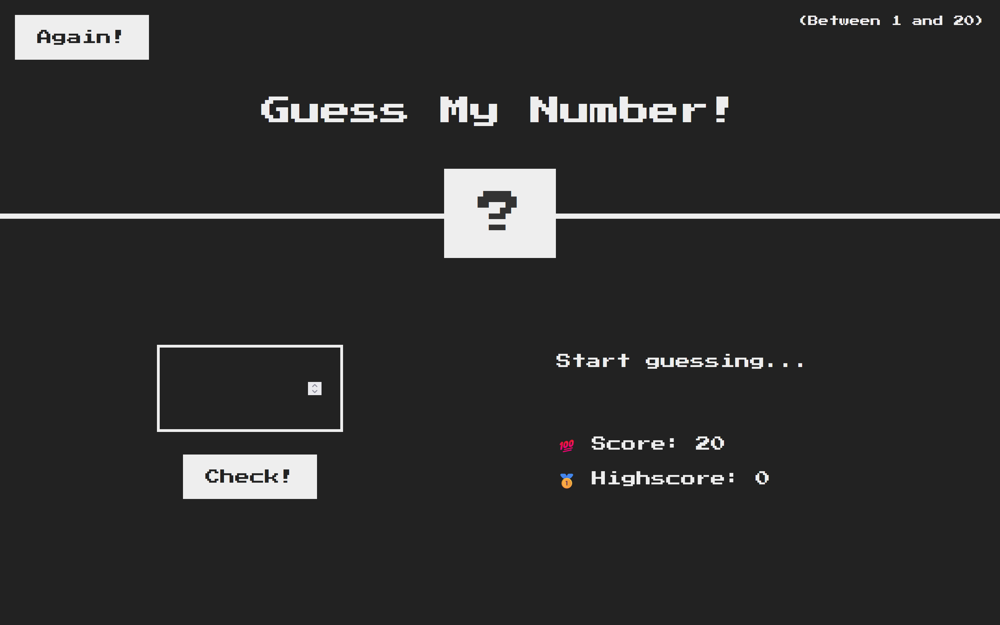

# Guess My Number Game 🔢

Welcome to the **Guess My Number** game! This is a simple web-based game where you try to guess a randomly generated number within a certain range. It's built using [React JS](https://create-react-app.dev/) and hosted on [Vercel](https://vercel.com/).

<br>

## 🚀 Live Demo

Check out the live version of the game:
[https://guess-my-number-kez.vercel.app/](https://guess-my-number-kez.vercel.app/).

## 🛠️ Features

- **Interactive UI**: Easy-to-use interface with real-time feedback on your guesses.
- **Random Number Generation**: Every game starts with a new randomly generated number.
- **Simple and Fun**: A straightforward game designed for quick play sessions.

## 💻 Technologies Used

- **Frontend**: React.js, CSS
- **Hosting**: Vercel
- **Tooling**: Create React App

## 🎯 How to Play

1. Visit the [live demo](https://guess-my-number-kez.vercel.app/).
2. Enter your guess in the input field.
3. Click the "Check" button to see if your guess is correct.
4. The game will tell you if your guess is too high, too low, or correct.
5. You **win** the game if you guess the correct number within 20 tries.
6. You **lose** the game if you run out of guesses without finding the correct number.
7. After winning or losing, you can click the "Again" button to start a new game and try again!

## 📸 Screenshots



## 🔧 Installation

If you want to run this project locally, follow these steps:

1. Clone the repository:
   ```bash
   git clone https://github.com/Kezota/guess-my-number.git
   ```
2. Navigate to the project directory:
   ```bash
   cd guess-my-number
   ```
3. Install the dependencies:
   ```bash
   npm install
   ```
4. Start the development server:
   ```bash
   npm start
   ```
5. Open `http://localhost:3000` in your browser to view the game.

## 👏 Credits

This project was built using templates and designs provided by [Jonas Schmedtmann](https://github.com/jonasschmedtmann)

## 🤝 Contributing

If you'd like to contribute to the development of this project, feel free to fork the repository and submit a pull request. Contributions are always welcome!
